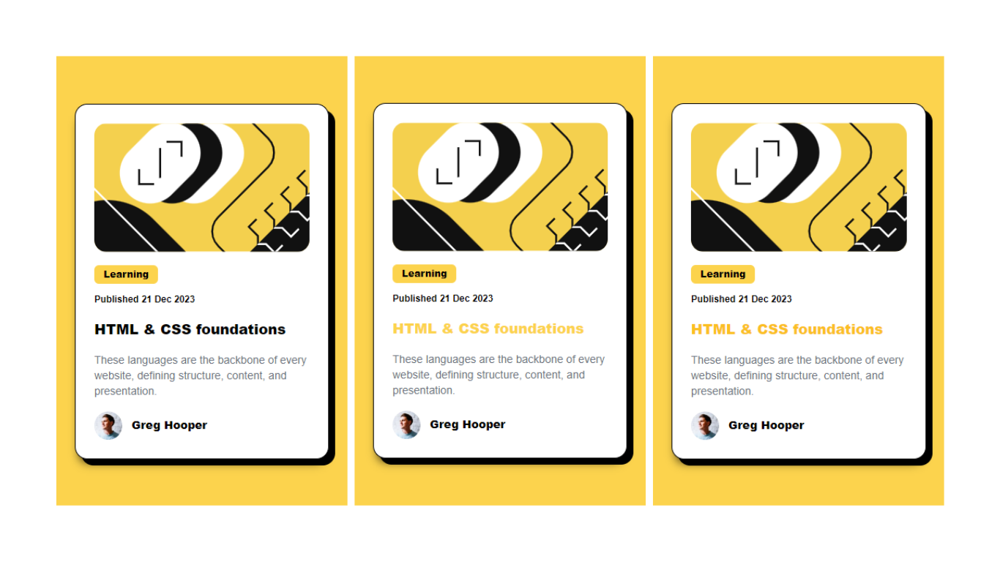

<!-- # Solution - blog-preview-card -->
# Frontend Mentor - blog-preview-card-solution

This is a solution to the [Blog preview card challenge on Frontend Mentor](https://www.frontendmentor.io/challenges/blog-preview-card-ckPaj01IcS). Frontend Mentor challenges help you improve your coding skills by building realistic projects. 

## Table of contents

- [Overview](#overview)
  - [The challenge](#the-challenge)
  - [Screenshot](#screenshot)
  - [Links](#links)
- [My process](#my-process)
  - [Built with](#built-with)
  - [What I learned](#what-i-learned)
  - [Useful resources](#useful-resources)
- [Author](#author)


## Overview

### The challenge

Users should be able to:

- See hover and focus states for all interactive elements on the page

### Screenshot



### Links

- Solution URL: [Github Page](https://danielmontes9.github.io/blog-preview-card/)

## My process

### Built with

- Semantic HTML5 markup
- Mobile-first workflow
- CSS custom properties
- [TailwindCSS](https://tailwindcss.com/) - CSS framework

### What I learned

Add extra settings in tailwind, like fontFamily and maxWidth in **tailwind.config.js**:

```js
/** @type {import('tailwindcss').Config} */
module.exports = {
  content: ["./src/**/*.{html,js}"],
  theme: {
    extend: {
      fontFamily: {
        custom: ['Figtree', 'sans-serif'],
      },
      maxWidth: {
        '88': '22rem'
      }
    },
  },
  plugins: [],
}
```
Add a command to compile tailwind in **package.json**:

```js
{
  "devDependencies": {
    "tailwindcss": "^3.4.0"
  },
  "scripts": {
    "build:css": "tailwindcss -i ./src/styles/input.css -o ./dist/output.css --watch"
  }
}
```

### Useful resources

- [Box Shadow](https://html-css-js.com/css/generator/box-shadow/) - This page helped me to generate the shadow of the card.

## Author

- Frontend Mentor - [@danielmontes9](https://www.frontendmentor.io/profile/danielmontes9)
